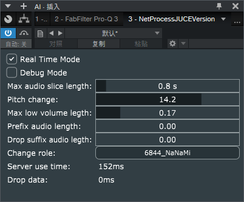

# 基于异步网络IO的VST声音处理插件

借助该VST3插件，可以实现将DAW的音频信号通过HTTP协议发送到音频处理程序中，用以实现C/S结构的音频信号处理系统

举例：

结合[AI猫雷](https://github.com/IceKyrin/sovits_f0_infer/tree/main)项目，可以将猫雷变声器集成到你的DAW中

# 安装

## 文件复制

在release页面下载最新的压缩包，解压后会有3个文件`netProcessConfig.json`，`NetProcessJUCEVersion.vst3`，`samplerate.dll`，将这些文件放在如下目录下`C:\Program Files\Common Files\VST3\NetProcessJUCEVersion`，！！！！注意路径一定要对，不然可能DAW扫描不到VST插件

## 配置文件修改，多角色模型配置

按需要修改`netProcessConfig.json`中的内容，其中每个字段的定义如下

|  字段   | 默认值  | 说明 |
|  ----  | ----  | --- |
| configVersion  | "2.0" | 配置文件版本号（别改） |
| fSampleVolumeWorkActiveVal  | 0.05 | 音量阈值（范围0-1），低于这个阈值被认为是静音 |
| bEnableSOVITSPreResample  | false | 启用对SOVITS输入音频提前重采样，C++端重采样比Python后端快一点 |
| iSOVITSModelInputSamplerate  | 22050 | SOVITS输入音频提前重采样频率 |
| bEnableHUBERTPreResample  | false | 启用对HUBERT输入音频提前重采样，C++端重采样比Python后端快一点，如果后端不支持的话，这里用false |
| iHUBERTInputSampleRate  | 16000 | HUBERT输入音频提前重采样频率 |
| roleList  |  | 多角色配置列表 |

多角色配置字段说明，每个说话人一个配置字典

|  字段   | 默认值  | 说明 |
|  ----  | ----  | --- |
| apiUrl  | "http://127.0.0.1:6844" | 后端服务地址 |
| speakId  | "0" | 说话人ID |
| name  | "XXXX" | 说话人名称（只支持字母或者数字），会显示在插件UI界面便于切换说话人 |

## VST以及DAW配置

插件安装完毕后会在StudioOne里按如下显示

插件的界面如下

|  选项   | 默认值  | 说明 |
|  ----  | ----  | --- |
| real time mode  | 关 | 实时模式（效果较差，别有太高期待） |
| Debug mode  | 关 | Debug开关（保持关闭就行） |
| Max audio slice length  | 0.8s | 最长音频切片 |

## DAW采样率

studioOne里工程的采样率应设置为44.1Khz

# 兼容性测试

## 联系方式

QQ:896919430

Bilibili:[串串香火锅](https://space.bilibili.com/4958385)

