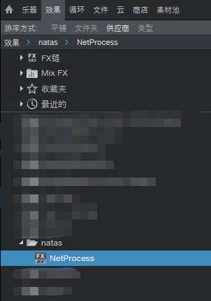
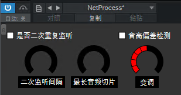
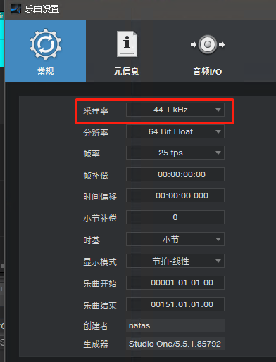

# 基于异步网络IO的VST声音处理插件

借助该VST3插件，可以实现将DAW的音频信号通过HTTP协议发送到音频处理程序中，用以实现C/S结构的音频信号处理系统

举例：

结合[AI猫雷](https://github.com/IceKyrin/sovits_f0_infer/tree/main)项目，可以将猫雷变声器集成到你的DAW中

## VST以及DAW配置

在release页面提供了打包好的VST插件，打包好的插件默认调用的API是一个[测试用的接口](http://ros.bigf00t.net:6842)，有需要可以修改[source\ss_process.cpp](source\ss_process.cpp)里的接口地址适配自己本地的HTTP接口，用于降低延迟

插件安装完毕后会在StudioOne里按如下显示

插件的界面如下

`是否二次重复监听`启用后，会将耳返的声音重复两遍。

`二次监听间隔`用于在二次重复监听启用后在两次耳返中插入一个静音间隔。

`最长音频切片`用于控制在调用HTTP接口前，最长的音频切片大小，过短的切片可能会导致爆音，过长的值则增加耳返延迟。

`变调`是猫雷AI模型的变调入参，旋钮范围是0-30。

studioOne里工程的采样率应设置为44.1Khz

需建立`C:/temp/vst/`目录用于存储临时文件

多角色模型的配置文件模板在[doc/netProcessConfig.json](doc/netProcessConfig.json)，需要复制到`C:/temp/vst/`目录下
